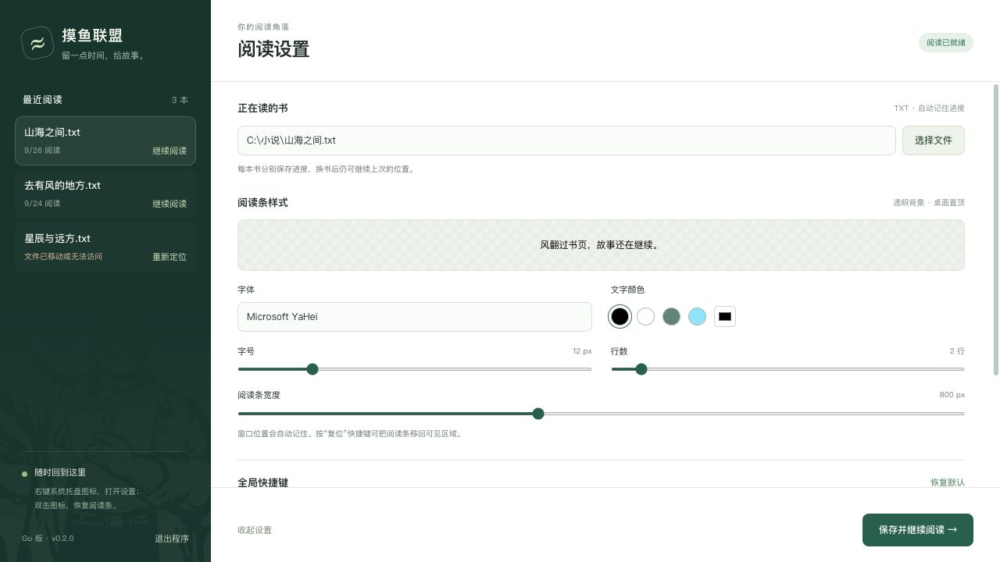
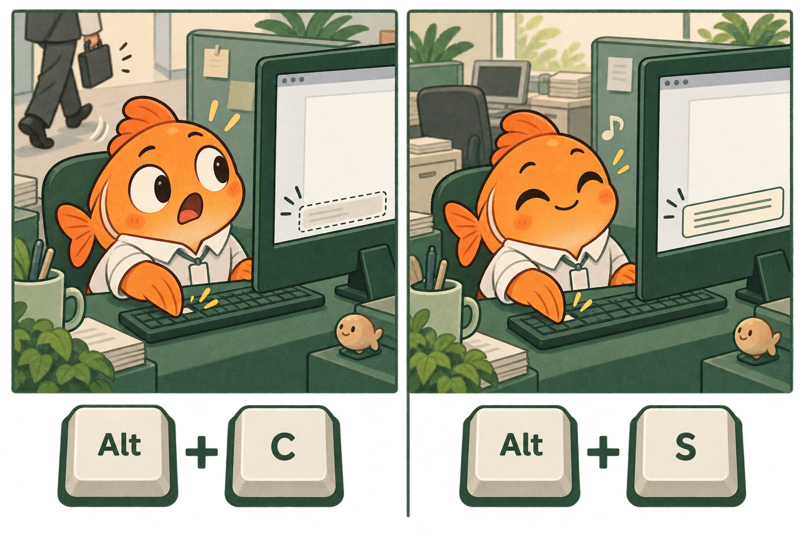
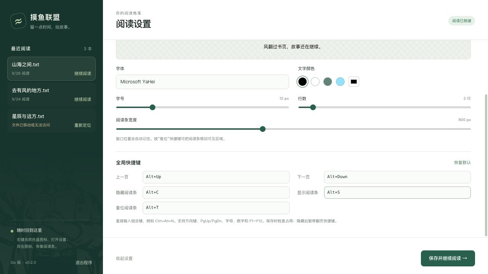

# 摸鱼联盟 · Go 版 🐟

**人在桌面，心在江湖。下一章很精彩，快捷键也得安排。**

一个轻巧的 **Windows 桌面 TXT 悬浮阅读器**：把小说放进透明置顶阅读条，用快捷键翻页、收起、继续；每本书各自记住读到哪里。


**当前版本：0.2.0 · Windows 10 / 11 x64 · Go 实现**

从这一版起，C# / WPF 版光荣退休，Go 版继续营业。旧源码仍可在 Git 历史中查看。这里的鱼负责陪你读书，KPI 得另请高明。

[快速上手](#三步开读主角已经等急了) · [功能说明](#这条鱼都会什么) · [默认快捷键](#2-快捷键收放自如剧情随叫随到) · [构建下载](#下载与构建自己动手也能开鱼塘) · [更新记录](CHANGELOG.md)

## 三步开读，主角已经等急了

1. **解压运行**：打开构建包里的 `摸鱼联盟.exe`。
2. **把书请进来**：点「选择文件」，选一本电脑里的 TXT，调好字体、颜色和大小。
3. **点击「保存并开始阅读」**：按 `Alt + ↓` 翻到下一页，按住阅读条可拖动位置。故事开场。

**运行条件**：Windows 10 / 11，x64；已安装 [Microsoft Edge WebView2 Runtime](https://developer.microsoft.com/microsoft-edge/webview2/)。无需安装 .NET。首次启动若提示缺少 WebView2，安装微软的 Evergreen Runtime 后再启动即可。Windows EXE 不能直接在 macOS / Linux 上运行。



*本文两张界面截图均为程序实际使用的设置页，在浏览器中以演示书籍数据预览；并非 Windows 原生阅读条的实机截图。其余三张配图为原创功能插画。*

## 这条鱼都会什么？

### 1. 透明置顶阅读条：桌面很大，给故事留几行

文字悬浮在桌面上，背景透明、窗口置顶。你可以只看一行，也可以展开成自己的小小阅读角落。

在「阅读条样式」里调整，点「保存并开始阅读」应用：

| 能调整什么 | 范围 / 用法 | 人话版 |
| --- | --- | --- |
| 字体 | 输入本机已安装的字体名称，也可选预设 | 宋体、楷体、微软雅黑，各有各的江湖 |
| 字号 | 3–48 px | 字可以小，眼睛不能委屈 |
| 文字颜色 | 预设色 + 自定义颜色，支持黑字和白字 | 浅色桌面、深色桌面，都能搭 |
| 可见行数 | 1–15 行 | 一口一口读，或者一口炫几行 |
| 阅读条宽度 | 240–1600 px | 桌面多宽，故事就摆多宽 |
| 窗口位置 | 按住阅读条拖动，松开后保存 | 这次放这里，下次还在这里 |

设置页会预览字体、字号与颜色，方便先试穿，再出场。

### 2. 快捷键：收放自如，剧情随叫随到



| 默认按键 | 功能 | 记忆口诀 |
| --- | --- | --- |
| `Alt + ↑` | 上一页 | 等等，刚才谁说话？ |
| `Alt + ↓` | 下一页 | 就一页，真的最后一页。 |
| `Alt + C` | 隐藏阅读条 | C：藏一下。 |
| `Alt + S` | 显示阅读条 | S：故事，Start！ |
| `Alt + T` | 复位阅读条位置 | T：它回来了。 |

在设置页「全局快捷键」中直接输入组合键，例如 `Ctrl+Alt+N`、`Alt+PageDown`，再保存。支持 `Ctrl / Alt / Shift / Win` 与字母、数字、方向键、`PgUp / PgDn`、`Home / End`、`Space`、`F1–F12`；「恢复默认」可找回上表配置。

- **撞键会提醒**：本应用内重复组合会被拦下，被其他程序占用时也会提示。键盘的事，讲究先来后到。
- **隐藏后释放翻页热键**：收起阅读条时，上一页、下一页的按键交还给其他程序；再次显示时重新注册。如果这时被占用，会提示你处理冲突。

<details>
<summary>展开看看：快捷键在哪里改？</summary>



向下滚动设置页，就能找到「全局快捷键」。输入组合键后点击「保存并开始阅读」应用。

</details>

### 3. 系统托盘：设置关了，鱼还在

在 Windows 任务栏通知区域找摸鱼联盟图标，可能藏在 `^` 折叠区里。

| 操作 | 会发生什么 |
| --- | --- |
| 双击图标 | 恢复阅读条；尚未开始阅读时打开设置 |
| 右键 → 显示 / 隐藏阅读条 | 鼠标也能完成「收」和「放」 |
| 右键 → 打开设置 | 改字体、改热键，随时回到控制台 |
| 右键 → 更换书籍 | 打开选书入口，换一本接着看 |
| 右键 → 退出摸鱼联盟 | 保存进度并退出，今天的故事先到这里 |

已经开始阅读时，关闭设置窗口只会收起设置，阅读仍可继续。Windows 资源管理器重启后，程序也会尝试重新添加托盘图标。鱼有入口，不玩失踪。

### 4. 最近阅读 + 独立进度：换书可以，串台不行


- **最近读过的 30 本**放在左侧，点击就能切回去。
- **每本书单独保存位置**。仙侠读到渡劫，推理读到线索，来回换着看，各记各的账。
- **书搬家了也有办法**：列表会标出找不到的文件，点击「重新定位」，选择同一本 TXT 的新位置，保留原书签。
- **进度按实际显示位置记录**：把 Windows 控件中的位置换算为 UTF-8 字节书签；中文、表情与分块边界都做了处理，减少续读时的错位。

重新定位请选**同一本、内容相同的书**。如果你改了正文，或者拿另一本书冒名顶替，原来的位置自然可能对不上——书签有记忆，但不会破案。

### 5. 常见 TXT 编码：拒绝阅读「锟斤拷修仙传」

支持 **UTF-8（含 BOM）、GBK、带 BOM 的 UTF-16 LE / BE**，打开时自动解码并统一换行。老 TXT、新 TXT，都有机会坐上阅读条。

不需要为了换编码去手改配置。如果文件仍显示异常，先检查原文件编码；当前支持的范围就是上面这些。

### 6. 多屏与位置恢复：阅读条出走，也能喊回来

窗口位置会保存，支持多显示器布局。拔掉外接屏后，程序会把原来落在那块屏幕上的阅读条调整回当前可见区域。

找不到阅读条时，依次按 **`Alt + S` → `Alt + T`**：先显示，再复位。两招召回失踪人口。

### 7. 单实例与配置保护：鱼可以多，进程先来一条

| 小细节 | 实际作用 |
| --- | --- |
| 单实例启动 | 同一 Windows 登录会话重复打开时，会提示从托盘进入，避免多个进程抢热键、抢书签 |
| 原子保存配置 | 先写同目录临时文件，再替换正式文件，减少写入中断损坏配置的风险 |
| 设置与进度分开合并 | 改字号时保留最新书签和窗口位置，不让旧设置快照把进度带回昨天 |
| 失败时提示并回退 | 热键、阅读器或配置保存出错时，尽量恢复之前状态，不把失败假装成成功 |
| 旧 Go 配置迁移 | 兼容旧版配置与阅读位置；旧版位置本来就是估算值，迁移不能补回已经丢失的精度 |

配置保存在 `%AppData%\摸鱼联盟\config.json`。升级时替换 EXE、保留这个目录，就能继续使用已有设置和书签。完整操作见 [使用说明](docs/使用说明.md)。

## 下载与构建：自己动手，也能开鱼塘

### 获取 Windows 构建包

打开 [Windows 构建工作流](https://github.com/Z18393520308/kanxiaoshuo/actions/workflows/windows.yml)，选择一次**成功完成的运行**，在页面底部的 **Artifacts** 下载 `moyu-windows-amd64`（下载通常需要登录 GitHub）。解压 Artifact，再解压其中的应用 ZIP，运行 `摸鱼联盟.exe`。

ZIP 中包含 EXE、中文使用说明、验收说明和 SHA-256 校验文件。工作流上传构建产物，**不会自动创建 GitHub Release**。

### 从源码构建

Windows 安装 **Go 1.25**（与 CI 使用版本一致），在仓库根目录运行：

```powershell
powershell -NoProfile -ExecutionPolicy Bypass -File scripts/build.ps1
```

也可以双击 `kanxiaoshuo-go/build.bat`。脚本会校验依赖、运行 Go 测试与静态检查，并把应用、说明文档和校验文件打包到 `dist/`。代码要过关，鱼才准出摊。

想改代码或在 macOS / Linux 上做核心测试？请看 [开发说明](kanxiaoshuo-go/README.md)。Windows 原生窗口、托盘、全局热键与多显示器体验的验证范围见 [验证记录](docs/验证记录.md) 和 [Windows 验收清单](docs/Windows验收.md)。

## 常见问题：别急，鱼还没下班

| 问题 | 处理方式 |
| --- | --- |
| 双击没新窗口，只说已经运行？ | 去任务栏通知区域找托盘图标，再打开设置 |
| 阅读条找不到了？ | `Alt + S` 显示，`Alt + T` 复位；改过热键就用自己的组合 |
| 快捷键提示被占用？ | 换一组组合键，或调整占用它的其他软件 |
| 书籍显示「文件缺失」？ | 点「重新定位」，选择同一本书的新路径 |
| 能在线搜书、云同步吗？ | 当前专注本地 TXT 阅读，这两项尚未提供 |
| 有章节目录、全文搜索或自动翻页吗？ | 当前版本还没有，翻页用快捷键，换书用最近阅读 |
| 能自动识别老板靠近吗？ | 不能。`Alt + C` 需要你自己按，鱼暂未考取读心术资格证 |
| 超大 TXT 是流式读取吗？ | 目前整本解码到内存，再分块送入阅读控件；没有宣称无限容量 |

## 仓库导航

```text
kanxiaoshuo-go/       Go 应用、原生阅读条与内嵌设置界面
scripts/build.ps1    Windows 测试和打包入口
docs/               使用说明、验收记录与功能配图
VERSION             当前版本号
CHANGELOG.md        更新记录
```

第三方组件许可见 [THIRD_PARTY_NOTICES.txt](THIRD_PARTY_NOTICES.txt)。

**愿你的书签总能接上剧情，愿你的「最后一页」偶尔是真的。🐟**
